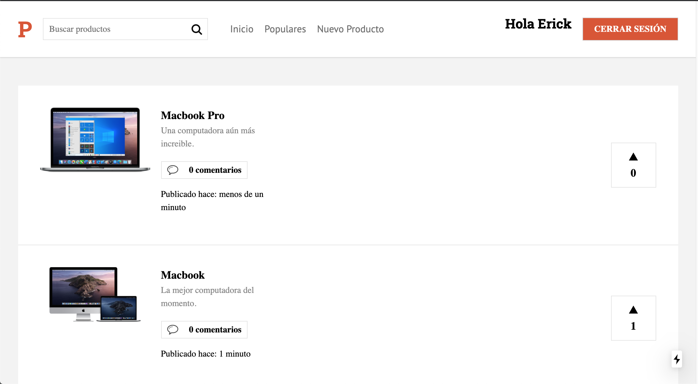

# 💻 Product Hunt

Este proyecto es un clon de Product Hunt con menos features, permite registrarse y una vez registrado crear productos. Los productos pueden ser comentados (los comentarios del creador tienen un badge distintivo), votados o eliminados (solo por el mismo creador). Se incluye un buscador de productos por nombre.



## 🛠 Scripts

```bash
# Instalar dependencias
$ npm install

# Encender servidor de desarrollo en localhost:3000
$ npm run dev

# Crear version de producción
$ npm run build && npm run export

```

## 💎 Tecnologías

- NextJS
- Firebase / Firestore
- Styled components
- Custom hooks

## 💣 Despliegue

https://angry-newton-0f43db.netlify.app/
